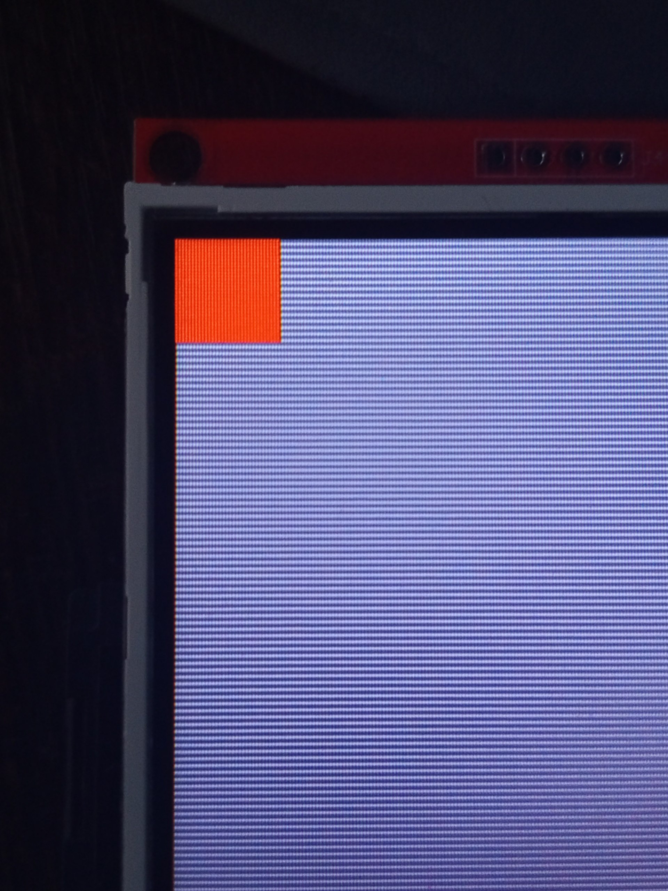

# ILI9341 Driver

Basic driver for ILI9341 display on ESP-IDF. The display is connected using the SPI interface.

During the development process, I used the technical documentation (provided below), analyzed the code of working libraries ([Adafruit ILI9341](https://github.com/adafruit/Adafruit_ILI9341), [TFT_eSPI](https://github.com/Bodmer/TFT_eSPI)) and [reddit.com/r/esp32](https://reddit.com/r/esp32):
- https://wiki.amperka.ru/_media/products:display-raspberry-pi-2n8in-spi:ili9341_datasheet.pdf
- https://www.alse-fr.com/sites/alse-fr.com/IMG/pdf/an_lt24.pdf
- https://docs.mikroe.com/mikrosdk/ref-manual/group__ili9341__commands.html


## Methods
#### Initializing the display
```c
esp_err_t ili9341_setup(gpio_num_t _cs, gpio_num_t _dc, 
  gpio_num_t _reset, gpio_num_t _miso, gpio_num_t _mosi, gpio_num_t _sclk);
```
#### Connecting the display using the SPI interface
```c
esp_err_t ili9341_spi_connect(void);
```
#### Sending command on the display
```c
esp_err_t ili9341_write_command(uint16_t cmd);
```
#### Sending data on the display
```c
esp_err_t ili9341_write_data(uint16_t data);
```
#### Hardware reset the display
```c
void ili9341_reset(void);
```
#### Setting the rendering window
```c
esp_err_t ili9341_set_address_window(uint16_t x, uint16_t y, uint16_t height, uint16_t width);
```
#### Drawing pixel on the display
> [!WARNING]  
> The display displays colors in BGR format, not RGB, so swap the bits to display the colors correctly if you supplement this driver (library).
```c
esp_err_t ili9341_draw_pixel(uint16_t x, uint16_t y, uint16_t color);
```

## Example code

```c
#include "ili9341.h"

void app_main(void) {
  ili9341_setup(33, 4, 12, 32, 19, 23, 18);
  for (int i = 0; i < 32; i++) {
    for (int j = 0; j < 32; j++) {
      ili9341_draw_pixel(i,j,0xF800);
    };
  };
};
```
### Result:

